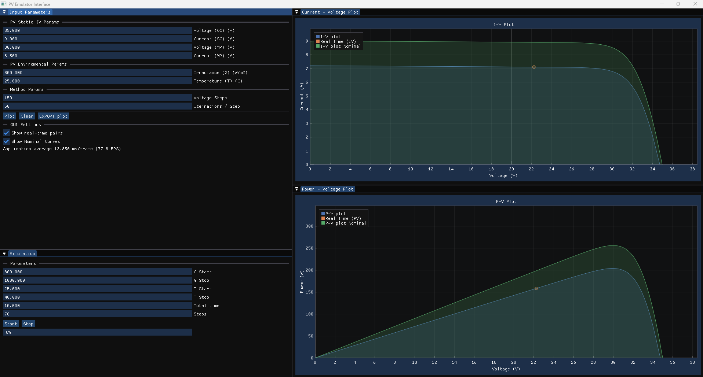

# PV Emulator and Monitoring UI

## An lightweight `imgui` and `implot` based PV Emulator and Monitoring UI

- Plot I-V and P-V curves of a PV model based only on the manufacturer characteristics
- Automated extraction of `Rs` and `Rsh`, using approximation analytical model
- Real time asyncronous plotting of received I-V pairs
- Real time sweep simulation of G and T (demo video)
- Virtual COM port communication `(#TODO)`

## Simulation Demo Video
